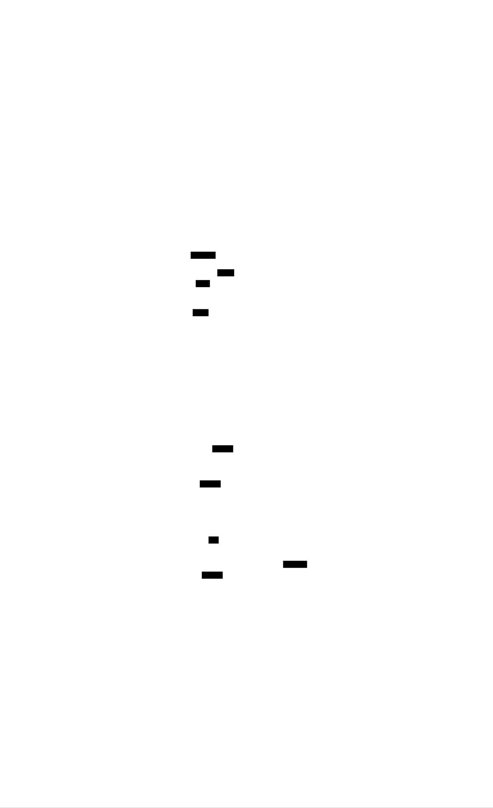
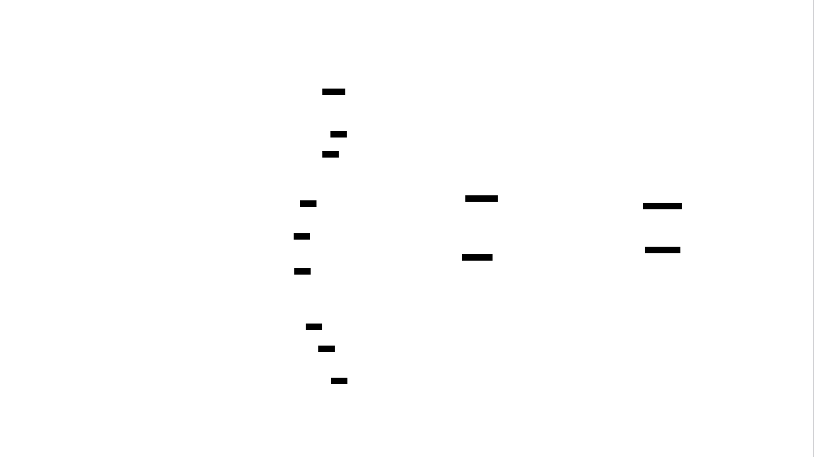

# Clawd HQ

A multi-agent AI orchestration platform running on a Mac Mini, coordinating 8 specialized agents across infrastructure automation, finance, recruiting, education, and prediction markets.

## Architecture

<picture>
  
</picture>

### Data Flow

<picture>
  
</picture>

## Agents

| Agent | Domain | Schedule | Key Capabilities |
|-------|--------|----------|------------------|
| **HAL** | Orchestration | Always-on | Cross-domain synthesis, event bus coordination, system-wide decisions |
| **Trader** | Prediction Markets | 4h monitor | Kalshi API, ML models (NBA/NCAA), bankroll management, CLV tracking |
| **Recruiter** | Job Applications | 4h pipeline | Multi-platform automation (LinkedIn, Indeed, Dice), resume tailoring |
| **Banker** | Personal Finance | Daily 6AM | BofA integration, expense tracking, budget alerts |
| **Professor** | Education | On-demand | Learning path management, study material generation |
| **CEO** | Strategy | On-demand | Cross-agent briefings, strategic planning, business development |
| **Sentinel** | Infrastructure | Hourly | 5-machine health checks, service monitoring, auto-recovery |
| **Trainer** | Personal Fitness | On-demand | Workout programming, progress tracking, nutrition guidance |

## Key Systems

### Cross-Agent Event Bus
SQLite-backed pub/sub system enabling real-time communication between agents. Categories: `decision`, `alert`, `state_change`, `discovery`. Severity levels with automatic escalation.

[Read more →](docs/event-bus.md)

### HAL Synthesis Heartbeat
Every 6 hours, HAL queries all agent memories and recent events, synthesizes cross-domain insights via Gemini Flash, and distributes findings to Telegram and Mem0.

[Read more →](docs/synthesis.md)

### Memory Architecture
Dual-namespace Mem0 Cloud integration: personal namespace for cross-device agent memory, shared namespace for multi-user collaboration with DLP sanitization.

[Read more →](docs/memory-system.md)

### Infrastructure
5-machine Tailscale mesh, LaunchAgent-based scheduling, Docker services (Uptime Kuma, Langfuse, Beszel, n8n), A2A protocol for inter-machine agent communication.

[Read more →](docs/infrastructure.md)

## Tech Stack

- **Orchestration**: OpenClaw (custom gateway), LaunchAgents, cron
- **AI Models**: Claude (Opus/Sonnet), Gemini Flash, Mistral Large
- **Memory**: Mem0 Cloud (personal + shared orgs)
- **Communication**: Telegram Bot API, A2A Protocol (Google SDK)
- **Monitoring**: Uptime Kuma, Beszel, Langfuse, custom health checks
- **Networking**: Tailscale mesh (5 machines)
- **Data**: SQLite (event bus, positions, pipeline), JSON (configs)
- **Markets**: Kalshi API (RSA-signed requests)
- **Jobs**: Playwright, nodriver, multi-platform automation

## Documentation

- [System Architecture](docs/architecture.md)
- [Agent System](docs/agent-system.md)
- [Event Bus Design](docs/event-bus.md)
- [Synthesis System](docs/synthesis.md)
- [Memory System](docs/memory-system.md)
- [Infrastructure](docs/infrastructure.md)
